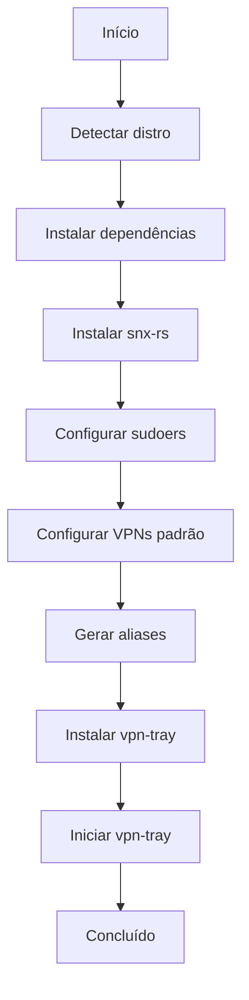

# Arquitetura do vpn-egsys

## Visão Geral da Arquitetura

O **vpn-egsys** é um sistema modular composto por três componentes principais:

```
┌─────────────────────────────────────────────────────────────────────┐
│                        vpn-egsys                                  │
├─────────────────────────────────────────────────────────────────────┤
│                                                                  │
│  ┌──────────────┐    ┌──────────────┐    ┌──────────────┐          │
│  │  install.sh  │    │  update.sh   │    │ vpn-tray     │          │
│  │  (Instalação)│    │(Gerenciador) │    │  (Monitor)   │          │
│  └──────┬───────┘    └──────┬───────┘    └──────┬───────┘          │
│         │                  │                  │                   │
│         ▼                  ▼                  ▼                   │
│  ┌─────────────────────────────────────────────────────────┐      │
│  │                 ~/.config/snx-rs/                        │      │
│  │   vpnro.conf, vpnpr.conf, vpnam.conf, ...               │      │
│  └─────────────────────────────────────────────────────────┘      │
│         │                                                  │      │
│         ▼                                                  ▼      │
│  ┌──────────────┐                              ┌──────────────┐     │
│  │  .bashrc     │                              │  .zshrc      │     │
│  │  .bashrc     │                              │  aliases     │     │
│  └──────────────┘                              └──────────────┘     │
│                                                                  │
│  ┌─────────────────────────────────────────────────────────┐      │
│  │                 /etc/sudoers.d/vpn-egsys                 │      │
│  └─────────────────────────────────────────────────────────┘      │
└─────────────────────────────────────────────────────────────────────┘
```

---

## Componentes Principais

### 1. Scripts de Instalação e Configuração

#### `install.sh` - Instalador

**Responsabilidades:**
- Detecção do sistema operacional
- Instalação de dependências
- Instalação do `snx-rs`
- Configuração do sudoers
- Configuração das VPNs padrão
- Geração de aliases
- Instalação do vpn-tray

**Fluxo de Execução:**



**Dependências por Distro:**

| Distro | Dependências |
|--------|--------------|
| Debian/Ubuntu | python3-gi, gir1.2-gtk-3.0, gir1.2-ayatanaappindicator3-0.1, libwebkit2gtk |
| Arch | python-gobject, gtk3, libayatana-appindicator, webkit2gtk |
| Fedora/RHEL | python3-gobject, gtk3, libayatana-appindicator-gtk3, webkit2gtk4.1 |

#### `uninstall.sh` - Desinstalador

**Responsabilidades:**
- Parar processos (vpn-tray, snx-rs)
- Remover arquivos instalados
- Remover configurações do sudoers
- Remover aliases
- Opcionalmente remover configurações de VPN

**O que NÃO faz:**
- Não remove o pacote `snx-rs` (requer comando manual)

---

### 2. Gerenciador de VPNs (`update.sh`)

**Arquitetura:**

```
┌─────────────────────────────────────────────────────────┐
│                     update.sh                             │
├─────────────────────────────────────────────────────────┤
│  ┌──────────────┐  ┌──────────────┐  ┌──────────────┐   │
│  │   list_vpns   │  │   add_vpn    │  │  update_vpn  │   │
│  │   ()         │  │   ()         │  │   ()         │   │
│  └──────┬───────┘  └──────┬───────┘  └──────┬───────┘   │
│         │                │                │            │
│         └────────────────┼────────────────┘            │
│                          ▼                                 │
│              ┌───────────────────┐                       │
│              │  ~/.config/snx-rs/ │                       │
│              │  vpn*.conf        │                       │
│              └────────┬──────────┘                       │
│                       │                                     │
│          ┌────────────┴────────────┐                    │
│          ▼                         ▼                    │
│   ┌──────────────┐          ┌──────────────┐            │
│   │ regenerate_  │          │  update_tray  │            │
│   │ aliases()    │          │  ()          │            │
│   └──────┬───────┘          └──────────────┘            │
│          │                                                │
│          ▼                                                │
│   ┌──────────────┐                                        │
│   │ .bashrc/.zshrc│                                        │
│   └──────────────┘                                        │
└─────────────────────────────────────────────────────────┘
```

**Funções Principais:**

| Função | Descrição | Arquivo Modificado |
|--------|-----------|-------------------|
| `list_vpns()` | Lista VPNs configuradas com servidor e usuário | stdout |
| `add_vpn()` | Adiciona nova VPN com credenciais | `~/.config/snx-rs/vpn*.conf` |
| `update_vpn()` | Atualiza credenciais de VPN existente | `~/.config/snx-rs/vpn*.conf` |
| `remove_vpn()` | Remove VPN | `~/.config/snx-rs/vpn*.conf` |
| `regenerate_aliases()` | Recria aliases no shell | `.bashrc`, `.zshrc` |
| `update_tray()` | Reinicia vpn-tray | Processos |

**Formato do Arquivo de Configuração (vpn*.conf):**

```ini
server-name=131.72.155.42
user-name=usuario
password=base64_encoded_password
ignore-server-cert=true
login-type=vpn
```

> ⚠️ **Segurança**: A senha é armazenada em base64, o que não é criptografia. Considerar usar um keyring para armazenamento seguro.

---

### 3. Monitor de Bandeja (`vpn-tray`)

**Tecnologias:**
- **Linguagem**: Python 3
- **GUI**: GTK 3 via PyGObject
- **AppIndicator**: Ayatana AppIndicator 3
- **Monitoramento**: subprocess + GLib timeout

**Arquitetura:**

```python
class VPNTray:
    ├── __init__()
    │   ├── discover_vpns()  # Descobre VPNs em ~/.config/snx-rs/
    │   ├── build_menu()    # Constrói menu GTK
    │   └── check_status()  # Verifica status inicial
    ├── discover_vpns()
    │   ├── glob.glob("~/.config/snx-rs/vpn*.conf")
    │   └── parseia server-name para label
    ├── build_menu()
    │   ├── status_item (✗ Desconectado / ✓ Conectado)
    │   ├── itens para cada VPN (Conectar {label})
    │   ├── Desconectar
    │   └── Sair
    ├── get_active_vpn()
    │   ├── check ip link show snx-xfrm
    │   └── check ps aux para processo snx-rs
    ├── check_status()
    │   ├── Chamado a cada 3 segundos via GLib.timeout_add_seconds
    │   ├── Atualiza ícone (vpn-connected/vpn-disconnected)
    │   └── Atualiza título e label de status
    ├── on_connect()
    │   ├── sudo killall snx-rs
    │   ├── sudo rm -f /run/snx-rs.lock
    │   └── nohup sudo snx-rs -m standalone -c {conf} -l info
    ├── on_disconnect()
    │   ├── sudo killall snx-rs
    │   └── sudo rm -f /run/snx-rs.lock
    └── on_quit()
        └── Gtk.main_quit()
```

**Fluxo de Conexão:**

```mermaid
sequenceDiagram
    participant U as Usuário
    participant T as vpn-tray
    participant S as snx-rs
    participant K as Kernel

    U->>T: Clica "Conectar VPN-X"
    T->>S: killall snx-rs (sudo)
    T->>K: rm -f /run/snx-rs.lock (sudo)
    T->>S: nohup sudo snx-rs -m standalone -c vpn.conf -l info
    S->>K: Cria interface snx-xfrm
    S->>/tmp: Escreve logs em snx-rs.log
    T->>K: ip link show snx-xfrm (a cada 3s)
    K-->>T: Interface existe
    T->>T: Atualiza status para ✓ Conectado
    T->>T: Troca ícone para vpn-connected
```

**Localizações Importantes:**

| Arquivo | Local | Propósito |
|---------|-------|-----------|
| `vpn-tray` | `~/.local/bin/` | Binário executável |
| Ícones | `~/.local/share/icons/vpn-egsys/` | Ícones SVG |
| Desktop Entry | `~/.local/share/applications/vpn-egsys.desktop` | Lançador |
| Autostart | `~/.config/autostart/vpn-tray.desktop` | Início automático |
| Logs | `/tmp/snx-rs.log` | Logs do snx-rs |
| Lock | `/run/snx-rs.lock` | Lock file do snx-rs |

---

## Fluxo de Dados

### 1. Fluxo de Instalação

```
User
  │
  ▼
./install.sh
  │
  ├── detect_distro() → /etc/os-release
  │       │
  │       ▼
  │   PKG_MANAGER (apt/pacman/dnf)
  │
  ├── install_deps() → sudo apt/pacman/dnf install
  │
  ├── install_snx_rs() → curl + download snx-rs
  │
  ├── setup_sudoers() → /etc/sudoers.d/vpn-egsys
  │
  ├── setup_vpn() → ~/.config/snx-rs/vpn*.conf
  │
  ├── setup_aliases() → ~/.bashrc, ~/.zshrc
  │
  └── install_tray() → ~/.local/bin/vpn-tray, icons, autostart
```

### 2. Fluxo de Conexão VPN

```
User → vpn-tray (Menu) → on_connect()
  │
  ├── sudo killall snx-rs
  ├── sudo rm -f /run/snx-rs.lock
  └── nohup sudo snx-rs -m standalone -c ~/.config/snx-rs/vpnro.conf -l info
                                      │
                                      ├── -m standalone: Modo standalone
                                      ├── -c: Arquivo de configuração
                                      └── -l info: Nível de log
```

### 3. Fluxo de Monitoramento

```
GLib.timeout_add_seconds(3, check_status)
  │
  └── check_status()
      │
      ├── get_active_vpn()
      │   ├── ip link show snx-xfrm
      │   └── ps aux | grep snx-rs
      │
      └── Atualiza UI:
          ├── indicator.set_icon_full()
          ├── indicator.set_title()
          └── status_item.set_label()
```

---

## Configurações e Arquivos

### Arquivos de Configuração

| Arquivo | Local | Formato | Permissões |
|---------|-------|---------|-------------|
| vpn*.conf | `~/.config/snx-rs/` | INI-like | 600 |
| vpn-egsys | `/etc/sudoers.d/` | Text | 0440 |
| .bashrc/.zshrc | `~/` | Bash | 644 |

### Arquivos Instalados

| Arquivo | Local | Tipo |
|---------|-------|------|
| vpn-tray | `~/.local/bin/` | Script Python |
| *.svg | `~/.local/share/icons/vpn-egsys/` | Ícones |
| vpn-egsys.desktop | `~/.local/share/applications/` | Desktop Entry |
| vpn-tray.desktop | `~/.config/autostart/` | Autostart |

### Processos

| Processo | Comando | Descrição |
|----------|---------|-----------|
| vpn-tray | `python3 ~/.local/bin/vpn-tray` | Monitor de bandeja |
| snx-rs | `sudo snx-rs -m standalone -c vpn.conf -l info` | Conexão VPN |

---

## Segurança

### Permissões Sudoers

O arquivo `/etc/sudoers.d/vpn-egsys` contém:

```
USER ALL=(ALL) NOPASSWD: /usr/bin/snx-rs, /usr/bin/killall snx-rs, /usr/bin/rm -f /run/snx-rs.lock
```

**Riscos:**
- Qualquer usuário com acesso ao terminal pode executar `snx-rs` sem senha
- O `killall snx-rs` pode ser usado para matar processos de outros usuários
- O `rm -f /run/snx-rs.lock` é específico e seguro

**Mitigações:**
- Arquivo com permissões 0440 (root:root)
- Validado com `visudo -cf` antes de aplicar
- Apenas o usuário atual tem permissões (USER)

### Armazenamento de Senhas

As senhas são armazenadas em base64 nos arquivos `.conf`:

```ini
password=base64_encoded_string
```

**Riscos:**
- Base64 não é criptografia, apenas encoding
- Arquivos `.conf` têm permissão 600 (somente usuário)
- Qualquer usuário root pode ler as senhas

**Melhorias Sugeridas:**
- Usar `libsecret` ou `gnome-keyring` para armazenamento seguro
- Criptografar senhas com uma master key
- Usar `snx-rs` com `--password-command` para injeção dinâmica

---

## Dependências Externas

### Pacotes de Sistema

| Pacote | Versão Mínima | Propósito |
|--------|---------------|-----------|
| python3 | 3.6+ | Linguagem principal |
| python3-gi | - | GObject Introspection |
| gir1.2-gtk-3.0 | 3.0 | GTK3 bindings |
| gir1.2-ayatanaappindicator3-0.1 | 0.1 | AppIndicator |
| libwebkit2gtk | 4.0+ | Dependência do AppIndicator |

### snx-rs

| Versão | Download | Instalação |
|--------|----------|------------|
| 5.2.3+ | GitHub Releases | DEB (Debian) / tar.gz (Arch/Fedora) |

**URL Base:** `https://github.com/ancwrd1/snx-rs/releases/download/v{version}/`

---

## Ambiente de Execução

### Variáveis de Ambiente Relevantes

| Variável | Valor Padrão | Propósito |
|----------|--------------|-----------|
| `HOME` | `/home/user` | Localização de arquivos de configuração |
| `PATH` | - | Include `~/.local/bin` |
| `DISPLAY` | `:0` | Display X11 para GTK |
| `XDG_RUNTIME_DIR` | `/run/user/{uid}` | Runtime directory |

### Arquivos de Estado

| Arquivo | Local | Propósito |
|---------|-------|-----------|
| `snx-rs.log` | `/tmp/` | Logs da conexão VPN |
| `snx-rs.lock` | `/run/` | Lock file para prevenir múltiplas instâncias |
| `vpn-tray` | Processo | PID do monitor |

---

## Resumo Técnico

| Aspecto | Valor |
|---------|-------|
| **Linguagens** | Bash, Python 3 |
| **Frameworks** | GTK3, PyGObject, Ayatana AppIndicator |
| **Total de Linhas** | ~640 (Bash + Python) |
| **Arquivos de Código** | 4 (install.sh, update.sh, uninstall.sh, vpn-tray) |
| **Arquivos de Configuração** | 1 (README.md, LICENSE, .gitignore, package.json) |
| **Ícones** | 2 (SVG) |
| **Documentação** | 6+ (README + docs/) |
